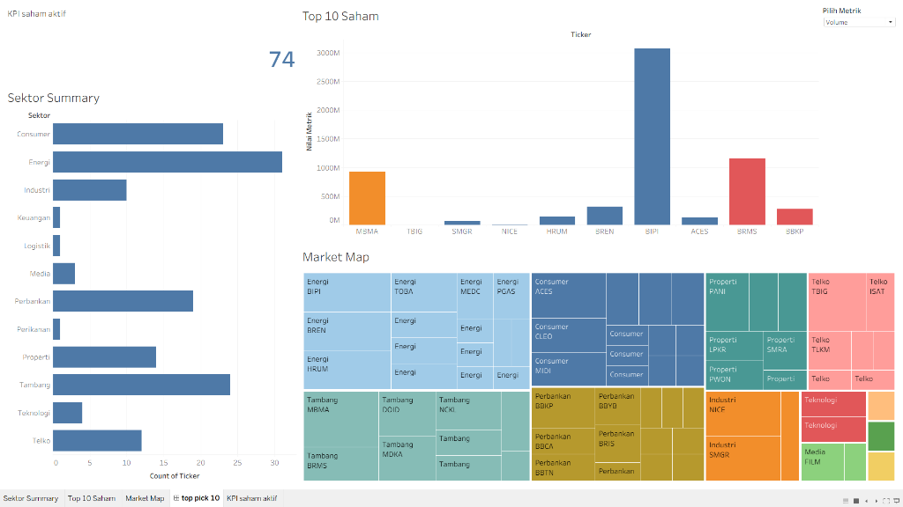
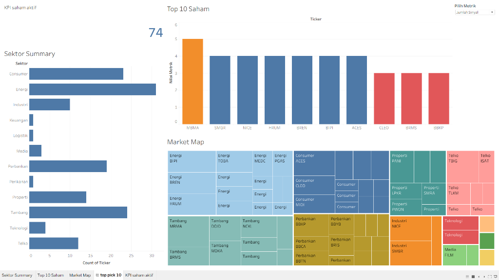
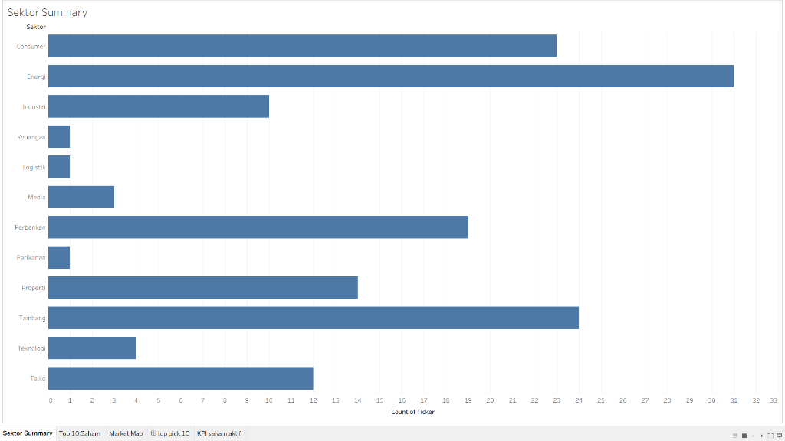
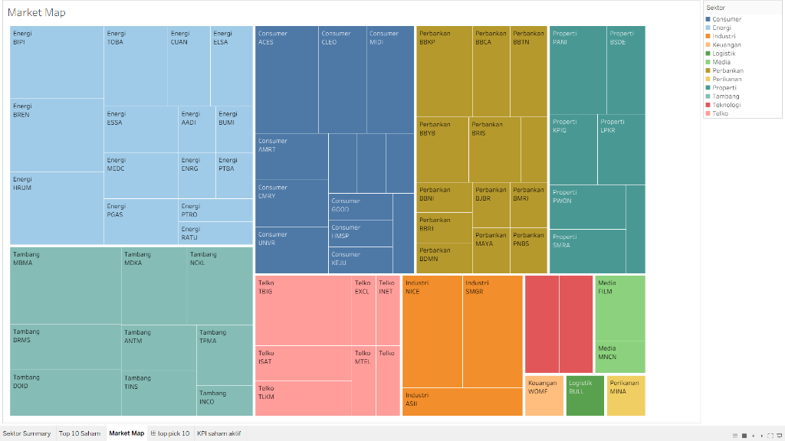
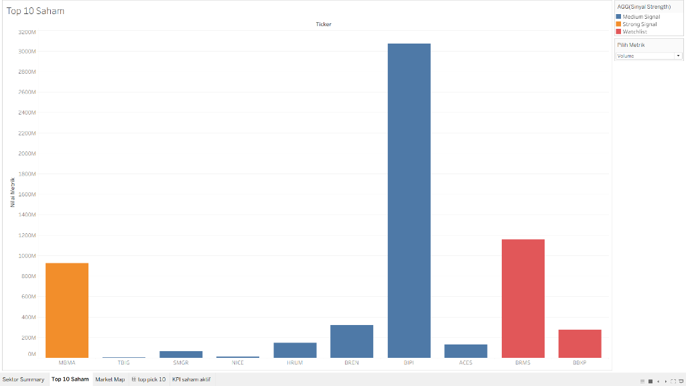
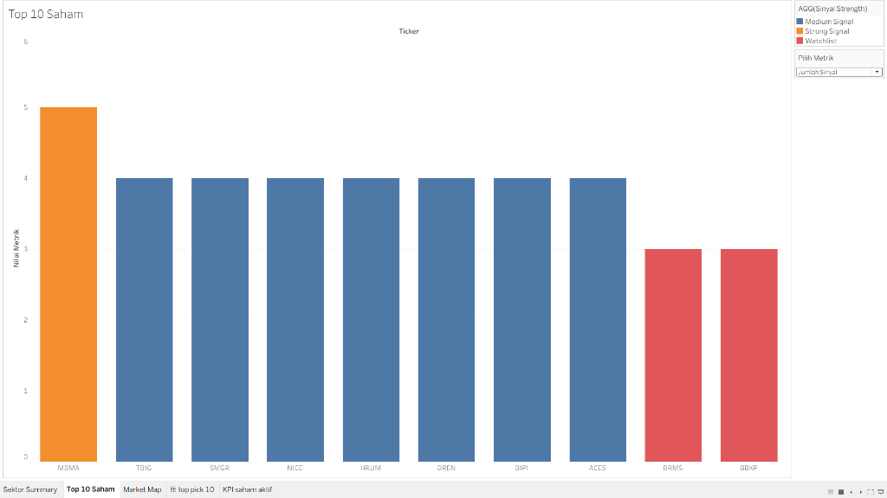
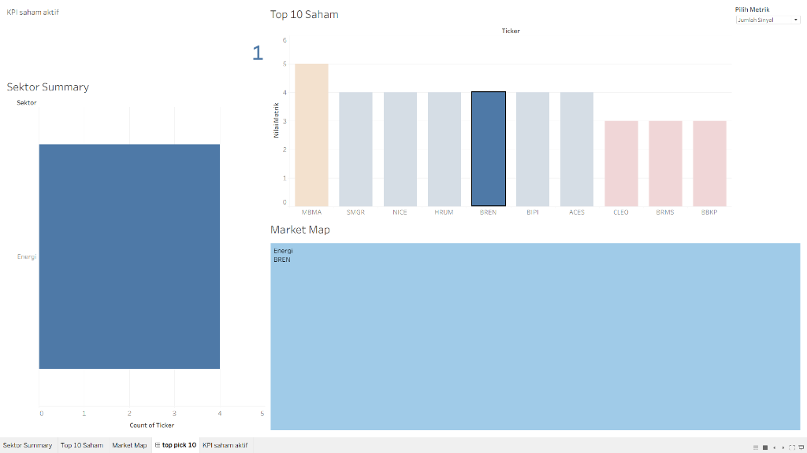

# 📊 Portofolio Analisis Data Saham BSJP
# Data Yang Digunakan Data Hasil Selama 1 Bulan 

Dokumentasi ini merangkum hasil analisis data historis hasil screening saham menggunakan strategi **BSJP (Beli Sore Jual Pagi)**. Data dianalisis dan divisualisasikan menggunakan **Tableau** untuk menemukan pola, tren sektor, dan saham teraktif.

---

## 📌 Ringkasan Eksekutif (KPI Dashboard)
Secara keseluruhan, terdapat **74 saham aktif** yang masuk dalam radar screener selama periode analisis ini. Dashboard dirancang dalam dua visualisasi utama untuk mempermudah analisis:

### A. Tampilan Berdasarkan Volume Transaksi
Menampilkan visualisasi *Top 10 Saham* berdasarkan volume perdagangan guna menilai likuiditas pasar.

### B. Tampilan Berdasarkan Jumlah Sinyal
Menampilkan visualisasi *Top 10 Saham* berdasarkan banyaknya indikator teknikal/rumus BSJP yang terpenuhi (sinyal beli).

---

## 🔍 Temuan Utama Analisis

### 1. Distribusi Sektor Paling Aktif (Sektor Summary)
Visualisasi ini menunjukkan jumlah emiten (saham) yang lolos filter BSJP berdasarkan sektor industrinya di IHSG.

* **Insight Utama**: 
  * Sektor **Energi** adalah sektor yang paling dominan dengan **31 saham** masuk radar BSJP.
  * Disusul oleh sektor **Tambang** (24 saham) dan **Consumer** (23 saham).
  * Sektor **Perbankan** juga aktif dengan 19 saham, menandakan likuiditas pasar di sektor-sektor komoditas dan keuangan sedang tinggi selama periode screening ini.

---

### 2. Peta Kekuatan Pasar (Market Map)
Peta pohon (Treemap) di bawah ini menggambarkan pembagian saham berdasarkan sektor masing-masing secara visual.

* **Insight Utama**:
  * **Sektor Energi** mendominasi volume area dengan emiten seperti **BIPI, BREN, HRUM,** dan **TOBA**.
  * **Sektor Tambang** dipimpin oleh **MBMA** dan **BRMS**.
  * Visualisasi ini memudahkan portofolio manager untuk melakukan diversifikasi sektor agar tidak menumpuk modal pada satu industri saja.

---

### 3. Top 10 Saham Berdasarkan Volume Transaksi
Grafik ini membandingkan volume transaksi 10 saham teratas yang memiliki kekuatan sinyal tertinggi.

* **Insight Utama**:
  * **BIPI** memimpin volume perdagangan secara masif (lebih dari **3 Miliar lembar saham**) dengan kategori sinyal *Medium Signal* (biru).
  * **BRMS** (kategori *Watchlist* - merah) dan **MBMA** (kategori *Strong Signal* - oranye) mengikuti dengan aktivitas volume yang signifikan di atas rata-rata pasar.

---

### 4. Top 10 Saham Berdasarkan Jumlah Sinyal
Grafik ini menunjukkan jumlah kriteria sinyal beli BSJP yang berhasil dipenuhi oleh masing-masing saham teratas.

* **Insight Utama**:
  * **MBMA** menjadi pilihan terkuat dengan mengumpulkan **5 Sinyal Kekuatan** sekaligus (*Strong Signal*).
  * Emiten lain seperti **TBIG, SMGR, NICE, HRUM, BREN, BIPI,** dan **ACES** memiliki **4 Sinyal** (*Medium Signal*), menjadikannya kandidat kuat untuk strategi Beli Sore Jual Pagi.

---

### 5. Interaktivitas Dashboard (Detail Pilihan Saham / Drill-down)
Dashboard ini memiliki fitur interaktif penuh. Saat pengguna memilih salah satu emiten teratas (misalnya saham **BREN** di bawah ini), seluruh metrik, ringkasan sektor, dan peta pasar akan terfilter secara dinamis untuk fokus pada emiten terpilih.

---

## 💡 Kesimpulan Portofolio
Dari hasil analisis Tableau ini, saham yang paling potensial untuk difokuskan dalam strategi BSJP adalah saham-saham di sektor **Energi dan Tambang (seperti MBMA dan BIPI)** karena kombinasi volume likuiditas yang tebal dan kekuatan sinyal teknikal yang sangat matang.
